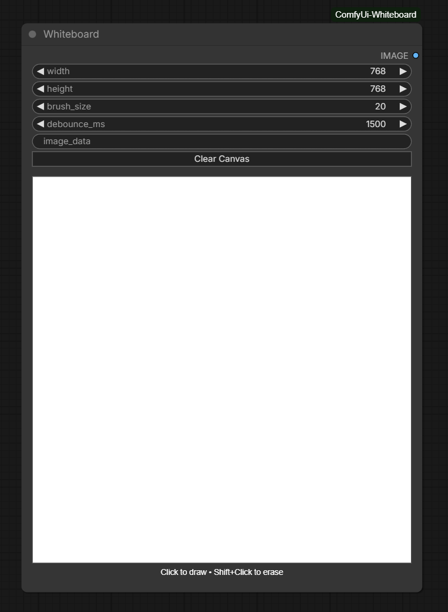

# ComfyUI-Whiteboard

A simple ComfyUI node that creates a white canvas for freehand drawing and automatically runs inference. Designed to be used in both img2img and sketch-to-image workflows (with ControlNet guidance).

**Features**
- Draw freely on a white canvas with adjustable brush size and color.
- Optional `Auto Run` mode: the node automatically triggers inference as you draw.
- Works as a control image for ControlNet-compatible nodes (sketch-to-image and img2img workflows).
- Lightweight and easy to integrate into existing ComfyUI flows.

**Installation**
- Place the `ComfyUi-Whiteboard` folder inside your ComfyUI `custom_nodes` directory.
- Restart ComfyUI.

**Basic Usage**
- Add the Whiteboard node to your graph.
- Draw on the canvas using the built-in drawing tools.
- Toggle `Auto Run` if you want inference to run automatically while drawing.

**Using with img2img**
- Connect your source image into your usual `Img2Img` pipeline.
- Connect the Whiteboard output to a ControlNet node's image input (or to any node that accepts a control image).
- Adjust denoising/strength settings on the Img2Img node to control how strongly your sketch influences the output.

**Sketch-to-Image (ControlNet) Workflow**
- Place the Whiteboard node and draw the desired sketch.
- Add a ControlNet node and connect the Whiteboard output to the ControlNet's image input.
- Connect ControlNet to your main sampler (txt2img or img2img) and configure weights/conditioning as needed.

**Tips**
- Use thicker brush strokes for stronger guidance in ControlNet.
- Try `Auto Run` off when making broad changes to avoid many automatic inferences.
- Combine the Whiteboard output with other control images (depth, canny, etc.) for richer effects.

**Files**
- The whiteboard's example preview image is expected at `images/main.png`.

**Support**
If you want me to add the actual provided preview image at `images/main.png`, please upload the image here (or replace the placeholder file in `images/` with your `main.png`).

---

License: same as the node repository (see LICENSE).
